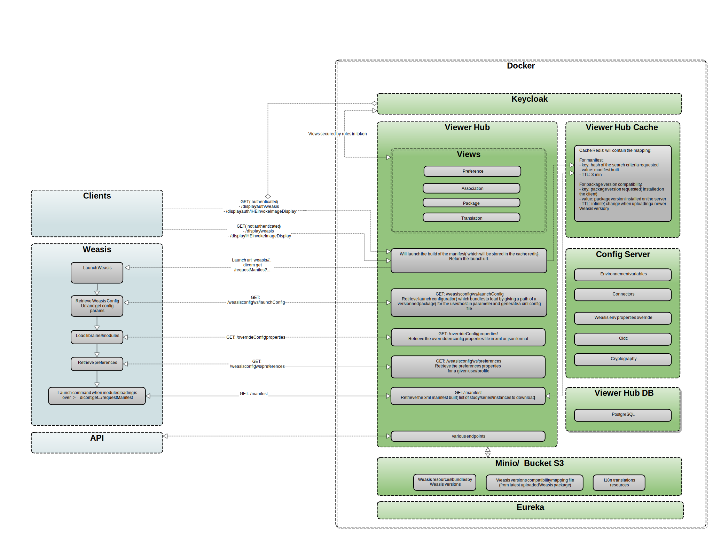


# Viewer-Hub
Viewer-Hub allows to manage various viewers on a IT Infrastructure. 

## Architecture


## Main functionalities
- Launch of Weasis viewers (several launch endpoints, including IHE IID Profile-compatible launch)
- Creation and association of user or machine groups
- Creation of an xml file (manifest) containing the studies, series and instances to be downloaded. This file will then be transmitted to Weasis to load the images into the viewer.
- Manifest storage in a redis cache
- Storage of resources required by the different versions of Weasis on Minio/S3
- Creation of versions of Weasis launched only for certain groups
- Live changed of Weasis properties 
- Versions management of i18n translations used by Weasis
- Compatibility management between versions of Weasis installed on clients and versions of resources uploaded in Viewer-Hub (storage on Minio S3 + cache)
- Pacs connectors management
- Retrieve OAuth2 tokens on IDP to enable Weasis to authenticate on dcm4chee pacs
- Cryptography of launch urls

## Launch the different containers in local

If you want to launch all the containers:
- Via the terminal, go to the folder "docker": cd docker

- Launch via the following docker command:
```
docker compose -p imaging_hub -f docker-compose.yml -f docker-compose.local.yml up -d
```

- Or launch via this command script:

```bash
  ./scripts/start.sh local
```

## Minio

The service "create-bucket" in docker-compose.local.yml will launch the creation of a bucket and an access key for viewer-hub.

It is also possible to create the bucket/access key manually:

- Access to the Minio console:
```  
http://localhost:9090
```
with

```
User: viewer-hub
Password: viewer-hub
```

- Once logged, go to Administrator -> Buckets and fill the bucket name with "viewer-hub-bucket", then create the bucket.
- Then go to User -> Access Keys and create the access key "access-key" with the secret key "secret-key"

## Keycloak

In order to access to the keycloak console: 
```
http://localhost:8085
```
with
```
User: admin
Password: admin
```

When launching Keycloak with the docker-compose file keycloak.yml in the docker folder, a configuration 
is directly imported in the keycloak container. This configuration will create: 
- a realm "viewer-hub"
- a client "viewer-hub" in order for the manager to connect with the authorization grant type "authorization_code"
- a user "viewer-hub-user" which will have a role "admin" associated in order to access to the different "secured" views of the application


## Dcm4chee 

In order to access to the pacs dcm4chee:
```
http://localhost:8080/dcm4chee-arc/ui2/en/study/study
```

As an example, you can import the file "dicom-example" located in the folders "docker -> dcm4chee" by using the dcm4chee interface.
("More functions" -> "Upload DICOM Object" -> "Select the STOW-RS server": "DCM4CHEE")

## Run configuration

- Configure the run configuration and add in VM options the following properties:
```
  -Duser.timezone=UTC
  -DENVIRONMENT=local
  -DEUREKA_CLIENT_SERVICE_URL_DEFAULT_ZONE=http://localhost:8761/eureka
  -DREGION=local
  -DDATACENTER=local
  -Dserver.port=8081
  -Dmanagement.server.port=19001
  -DBACKEND_URI=http://localhost:8081
  -DDB_HOST=localhost
  -DDB_PORT=45101
  -DDB_NAME=viewer-hub
  -DDB_USER=viewer-hub
  -DDB_PASSWORD=viewer-hub
  -DCONFIGSERVER_URI=http://localhost:8888
  -DS3_ACCESS_KEY=access-key
  -DS3_SECRET_KEY=secret-key
  -DS3_ENDPOINT=http://localhost:9080
  -DS3_BUCKET_NAME=viewer-hub-bucket
  -DBACKEND_URI=http://localhost:8081
```
- Then clean/install + run...

## Viewer Hub

In order to access to viewer-hub: 
```
http://localhost:8081
```
with

```
User: viewer-hub-user
Password: password
```

## Eureka

Once viewer-hub launched, it is possible to see the registration of the service at this address:
```
http://localhost:8761
```

## Launch Weasis

Once all the steps above completed, launch the below URL to launch Weasis and load the dicom image stored in the dcm4chee pacs
```
http://localhost:8081/display/weasis?studyUID=1.3.12.2.1107.5.1.4.54023.30000004093013443132800000021&archive=dcm4chee-local
```