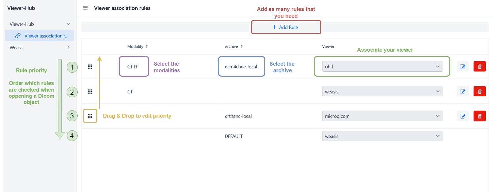
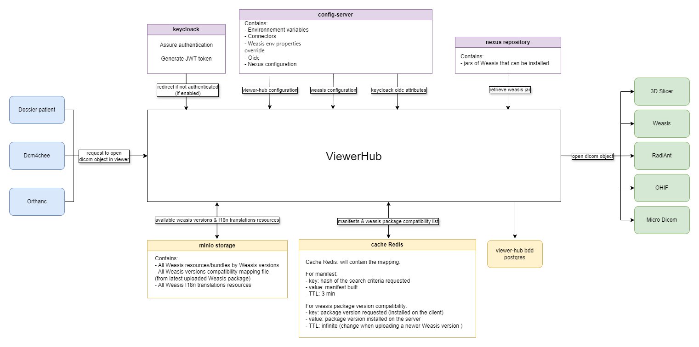


# ViewerHub
ViewerHub allows you to open the right viewer for each procedure depending on your custom needs.

## How it works

### Rules definition
You can create rules to specific which dicom viewer to open depending on:
- the modality of the exam
- the archive that requests to open the dicom object

Example:

The first rule in the example configuration bellow is to open the OHIF viewer if both:
- the Modality is CT or DT
- the archive is dcm4chee

If the condition is not met, ViewerHub will try the next rules in order, until one is valid (default viewer in last row)



You can also force the viewer by adding a `viewer` header or param to the request

### General architecture


See bellow [Try it yourself](#try-it-yourself) to run the application with all services (no extra configuration required)

### Viewers workflows
See page [integration schemas](src/main/resources/documentation/integration/README.md) to get details about how each viewer interacts with ViewerHub

### More documentation
https://weasis.org/en/viewer-hub/index.html

## Main goals
The goal of this project it to manage interfaces between PACS and Dicom viewers (like EAI for HL7 messages):
- centralize Dicom flows between PACS and viewer, when possible
- customize rules to open specific viewer depending on procedure
- assure authentication and authorization, when possible
- manage PACS and viewer configurations, when possible

## Current functionalities
- Launch of multiple viewers (Weasis, OHIF, 3D Slicer, Micro Dicom) with several launch endpoints, including IHE IID Profile-compatible launch
- Creation and association of user or machine groups
- Creation of an xml file (manifest) containing the studies, series and instances to be downloaded. This file will then be transmitted to Weasis to load the images into the viewer.
- Manifest storage in a redis cache
- Storage of resources required by the different versions of Weasis on Minio/S3
- Creation of versions of Weasis launched only for certain groups
- Live changes of Weasis properties
- Versions management of i18n translations used by Weasis
- Compatibility management between versions of Weasis installed on clients and versions of resources uploaded in Viewer-Hub (storage on Minio S3 + cache)
- Pacs connectors management
- Retrieve OAuth2 tokens on IDP to enable Weasis to authenticate on dcm4chee pacs
- Cryptography of launch urls
- Retrieve in Nexus the stored package versions of Weasis

## Try it yourself

A ready-to-use development environment has been provided in the repository. It is using docker-compose.

If you want to launch all the containers:
- Via the terminal, go to the folder "docker": cd docker

- Launch via the following docker command:
```
docker compose -p imaging_hub -f docker-compose.yml -f docker-compose.local.yml up -d
```

- Or launch via this command script:

```bash
  ./scripts/start.sh local
```

You will also need to run ViewerHub with you preferred IDE


### Viewer Hub

Launch it with your preferred IDE (bellow configuration is for InteliJ)
- Configure the run configuration and add in VM options the following properties:
```
  -Duser.timezone=UTC
  -DENVIRONMENT=local
  -DEUREKA_CLIENT_SERVICE_URL_DEFAULT_ZONE=http://localhost:8761/eureka
  -DREGION=local
  -DDATACENTER=local
  -Dserver.port=8081
  -Dmanagement.server.port=19001
  -DBACKEND_URI=http://localhost:8081
  -DDB_HOST=localhost
  -DDB_PORT=45101
  -DDB_NAME=viewer-hub
  -DDB_USER=viewer-hub
  -DDB_PASSWORD=viewer-hub
  -DCONFIGSERVER_URI=http://localhost:8888
  -DS3_ACCESS_KEY=access-key
  -DS3_SECRET_KEY=secret-key
  -DS3_ENDPOINT=http://localhost:9080
  -DS3_BUCKET_NAME=viewer-hub-bucket
  -DBACKEND_URI=http://localhost:8081
```
- Then clean/install + run...


In order to access to viewer-hub:
```
http://localhost:8081
```
Use the following credentials

```
User: viewer-hub-user
Password: password
```


### Dcm4chee

In order to access to the pacs dcm4chee:
```
http://localhost:8080/dcm4chee-arc/ui2/en/study/study
```

As an example, you can import the file "dicom-example" located in the folders "docker" -> "dicom-examples" by using the dcm4chee interface.
("More functions" -> "Upload DICOM Object" -> "Select the STOW-RS server": "DCM4CHEE")


### Orthanc

In order to access to the pacs orthanc:
```
http://localhost:8042
```

Use the following credentials:
```
User: orthanc-user
Password: password
```

As an example, you can import the file "dicom-example" located in the folders "docker -> dicom-examples" by using the orthanc interface.
("Upload" -> "Select files to upload" and then "Start the upload")

You can also rebuild the ViewerHub Orthanc plugin with the command:
```
docker-compose -f orthanc/orthanc-plugin-builder.yml up -d
```

### Minio

The service "create-bucket" in docker-compose.local.yml will launch the creation of a bucket and an access key for ViewerHub.

It is also possible to create the bucket/access key manually:

- Access to the Minio console:
```  
http://localhost:9090
```
Use the following credentials

```
User: viewer-hub
Password: viewer-hub
```

- Once logged, go to Administrator -> Buckets and fill the bucket name with "viewer-hub-bucket", then create the bucket.
- Then go to User -> Access Keys and create the access key "access-key" with the secret key "secret-key"

### Keycloak

In order to access to the keycloak console: 
```
http://localhost:8085
```
Use the following credentials
```
User: admin
Password: admin
```

When launching Keycloak with the docker-compose file keycloak.yml in the docker folder, a configuration 
is directly imported in the keycloak container. This configuration will create: 
- a realm "viewer-hub"
- a client "viewer-hub" in order for the manager to connect with the authorization grant type "authorization_code"
- a user "viewer-hub-user" which will have a role "admin" associated in order to access to the different "secured" views of the application


## Nexus

In order to access to the Nexus console:
```
http://localhost:8086/
```


### Eureka

Once ViewerHub launched, it is possible to see the registration of the service at this address:
```
http://localhost:8761
```


### Launch Weasis

Once all the steps above completed, launch the below URL to launch Weasis and the loading of the dicom image stored in the dcm4chee pacs
```
http://localhost:8081/display?viewer=WEASIS&studyUID=1.3.12.2.1107.5.1.4.54023.30000004093013443132800000021&archive=dcm4chee-local
```


### Launch OHIF

Once all the steps above completed, launch the below URL to launch OHIF and load the dicom image stored in the orthanc pacs
```
http://localhost:8081/display?viewer=OHIF&studyUID=1.3.12.2.1107.5.1.4.54023.30000004093013443132800000021&archive=orthanc-local
```


### Launch 3D Slicer

You need to install 3D Slicer in your machine to use it.
You also need to add the DICOMwebBrowser extension. It can be downloaded from the 3D Slicer GUI on View > Extension Manager > Install Extensions > search DICOMwebBrowser
Once all the steps above completed, launch the below URL to launch 3D Slicer and load the dicom image stored in the dcm4chee pacs
```
http://localhost:8081/display?viewer=SLICER&studyUID=1.3.12.2.1107.5.1.4.54023.30000004093013443132800000021&archive=dcm4chee-local
```


### Launch Micro Dicom 

You need to install Micro Dicom in your machine to use it.
You also need to add the DCM4CHEE/Archive AET to Micro Dicom configuration
Once all the steps above completed, launch the below URL to launch Micro Dicom and load the dicom image stored in the dcm4chee pacs
```
http://localhost:8081/display?viewer=MICRODICOM&studyUID=1.3.12.2.1107.5.1.4.54023.30000004093013443132800000021&archive=dcm4chee-local
```