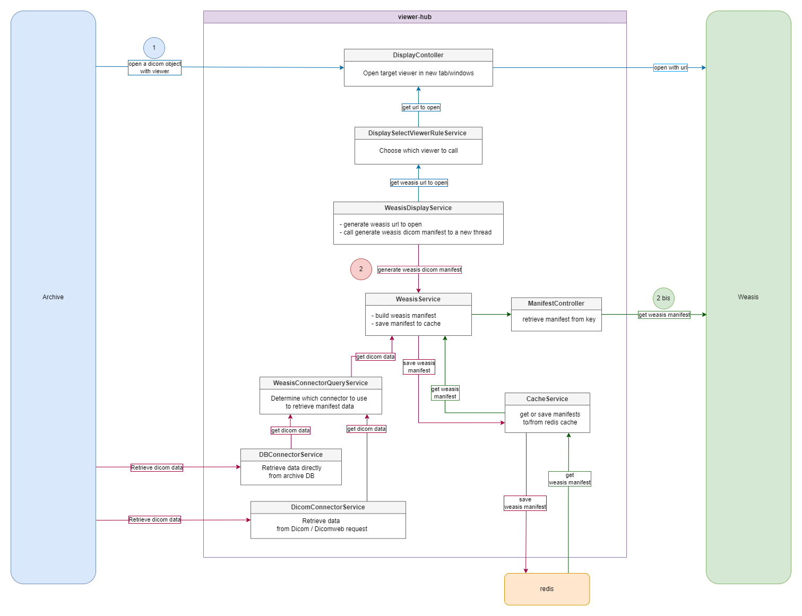
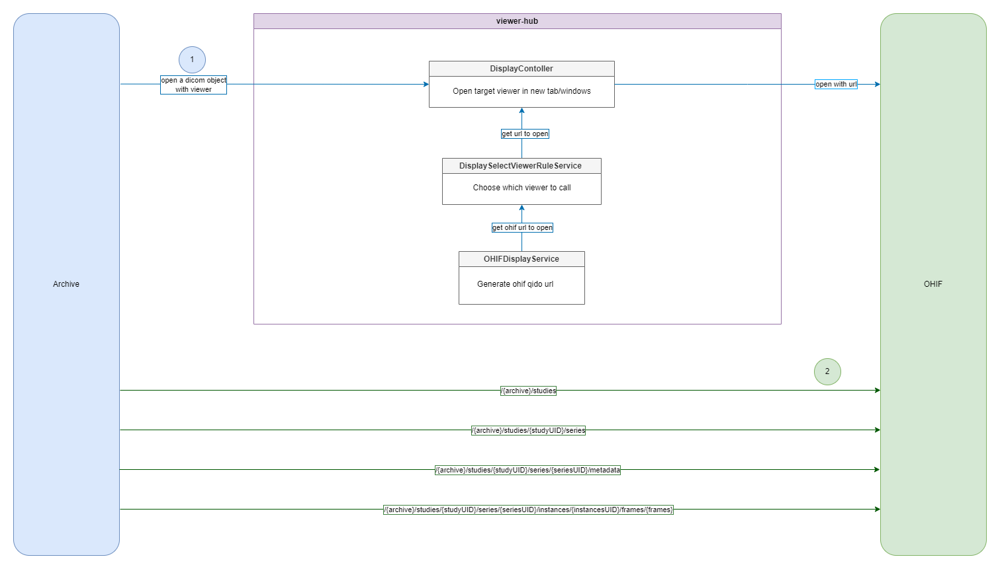
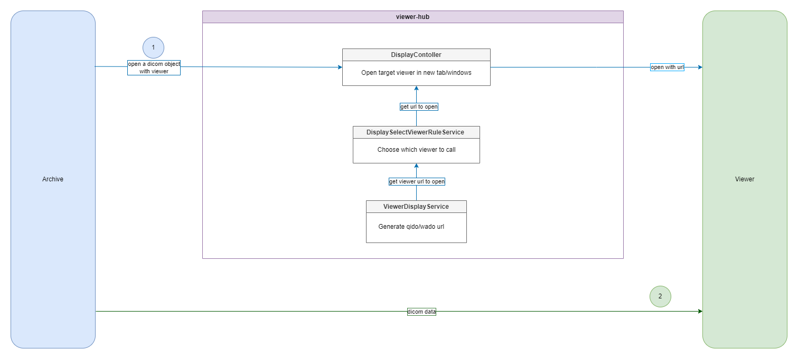

# ViewerHub integration schemas

Here are the internal workflows to open multiple Dicom Viewers with ViewerHub
- [Weasis - Dicom](#weasis-dicom-integration)
- [Weasis - Dicom-web](#weasis-dicom-web-integration)
- [OHIF - Dicom Web](#ohif-dicom-web-integration)
- [3D Slicer - Dicom Web](#slicer-3d-radiant-micro-dicom-integrations)
- [RadiAnt - Dicom](#slicer-3d-radiant-micro-dicom-integrations)
- [Micro Dicom - Dicom](#slicer-3d-radiant-micro-dicom-integrations)

## Weasis Dicom integration

## Weasis Dicom Web integration

## OHIF Dicom Web integration

## Slicer 3D, RadiAnt, Micro Dicom integrations

